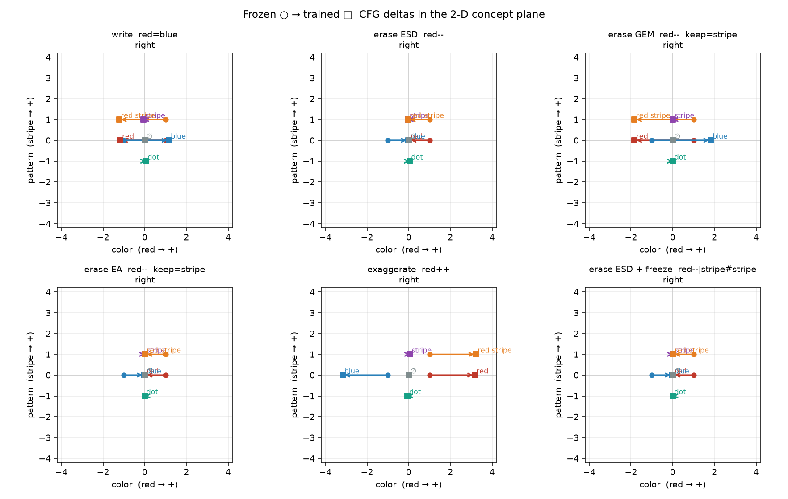
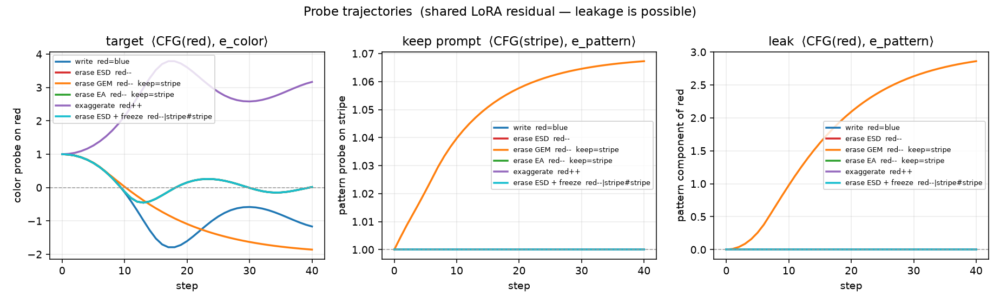
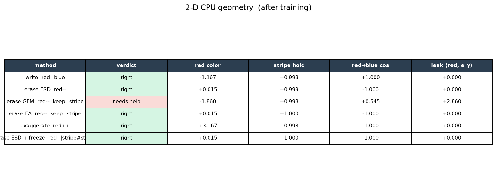

# 2-D CPU analysis: are the DSL / erase methods geometrically right?

A known-answer on a line (`red=blue`, cosine before/after) and a
prompt-gated ESD fixture (`stripe--` vs `dot`) cannot show collateral on
an orthogonal concept. This suite is a two-axis CPU field that reuses the
live losses — `ops.rule_loss` for DSL + ESD, `ops_erase.erase_loss` for
the GEM / EA hooks — and asks whether each method moves the target axis
and leaves the keep axis alone.

No GPU, no Hub, no 20B train. Plots live in
[`outputs/2d_analysis/`](../outputs/2d_analysis/).

## Verdict

| Method | Phrase | Verdict | What happened |
|---|---|---|---|
| write `=` | `red=blue` | **right** | Red CFG flips onto frozen blue. Stripe hold stays ~1. |
| erase ESD | `red--` (live `rule_loss`) | **right** | Default g=0 matches empty: red CFG goes to the origin, **not** onto blue. Stripe holds. `red--:guidance=1` is the old write-to-opposite. |
| erase GEM | `red--` + keep=`stripe` | **right** | Hinge attracts toward the ESD safe field (uncond / default g=0), not toward stripe. Leak `+2.86 → +0.00`. Stripe hold 1.000. Overshoots the color axis (hinge has no restoring force past the Voronoi cell). |
| erase EA | `red--` + keep=`stripe` | **right** | ESD plus a retain MSE on stripe. Red erases; stripe hold is 1.000 (a hair cleaner than ESD). |
| exaggerate `++` | `red++` | **right** | Classic (no random-probe) `++` stretches color from +1 to ~+3. Stripe holds. |
| ESD + freeze `#` | `red--\|stripe#stripe` | **right** | Live-DSL way to pin the keep axis. Same keep geometry as the EA hook. |

GEM is **no-longer-wrong**. Bare `--` now defaults to neutralize (`g=0`),
so GEM's safe attractor is the same uncond field ESD matches. GEM does
**not** help vs ESD on this fixture: ESD lands on the origin (`+0.015`)
while GEM coasts to `-1.83` (hinge slack past the Voronoi cell). EA /
`#` remain the retain. A real GEM port still needs the trajectory window
and dual-stream Q/K.



*Frozen ○ → trained □. Color is x (`red → +`), pattern is y (`stripe → +`).*



*Left: target probe. Middle: keep-prompt probe. Right: pattern component of `red` — GEM's convert-to-keep used to show up here; it is now flat.*



## How to run

```bash
# numbers the tests gate (no matplotlib required)
pytest tests/test_2d_analysis.py tests/test_erase_cpu.py tests/test_cpu_sample.py tests/test_dsl.py tests/test_ops.py -q

# pictures + metrics.json
python scripts/analyze_2d.py --out outputs/2d_analysis
```

`matplotlib` is only needed for the PNGs. The geometric claims are
probes / cosines, not pixels. Wall time for the six methods is well under
a second on CPU (40 Adam steps each); the existing 30s budget still
applies.

## The fixture

Two orthonormal concept axes, prompt-gated embeddings, **shared** rank-2
LoRA on the class path (same shape as LoRA on `CpuBackend.linear2`):

```
v(z, t, c) = 0.1 z + W e(c) + B A e(c)
```

- `e(red) = +e_x`, `e(blue) = −e_x`, `e(stripe) = +e_y`, `e(dot) = −e_y`
- A prompt that only says `red` does not activate the pattern axis
- `B` starts at 0 so trained == frozen at step 0
- Because the residual is shared, a method *can* leak. The older
  `TwoConceptVelocity` fixture cannot: its keep delta is never in the ESD
  graph.

Templates are pinned to `"{}"` (same pin as `tests/test_erase_cpu.py`) so
the story is the axes, not template coverage. Classic `++` is used — no
Hugging Face probe-prompt dataset.

Skipped: `^` (pixel L2, no 2-D velocity prediction), `;` (not
implemented), `~` (macro of `++` / `=` / `%`), standalone `%` (the axes
already start orthogonal, so the loss is ~0).

## What is right, and what is a side effect

**Write, ESD, `++`, EA, ESD+`#`, GEM** all move only the color column of
the linear map. Stripe's own CFG stays on `e_y`. That is the
geometrically right 2-D story, and it is what the 1-D cosine check could
not see.

Two caveats the pictures make obvious:

1. **Antipodal swap.** `e(blue) = −e(red)`, so a linear LoRA that remaps
   red to blue necessarily remaps blue to red. The write *loss* only
   trains the `red` prompt; the function class swaps the pair. The live
   `cpu` sample only scores `cosine(trained red, frozen blue)`, so a swap
   still passes. Remap-only write on a real DiT needs a residual that is
   not a linear map of antipodal embeddings (prompt-gated, or a richer
   class path). This is a fixture / function-class fact, not a bug in
   `ops.rule_loss`.

2. **Bare `--` is neutralize; g=1 is write-to-opposite.** The ESD
   target is `v* = v('') − g (v(red) − v(''))`. Default `g=0` is
   `v('')` (origin on this field). `g=1` is exactly `CFG(blue)` when
   blue is `−red` — that overshoot is now `red--:guidance=1` (or
   `--erase-guidance 1`), not the bare phrase.

## GEM vs ESD vs EA

Grebe et al. (ICML'26, [arXiv:2606.00140](https://arxiv.org/abs/2606.00140)
Eqs. 13–14) define

```
d_pos = ||v_t(c) − v_f(ĉ)||     # attract to the teacher's *safe* anchor
d_neg = ||v_t(c) − v_f(c)||     # repel from the teacher's erase field
L     = relu(d_pos − η d_neg)
```

Paper `ĉ` is a harmless rewording of `c` (or ESD reverse-CFG when no
explicit anchor exists — their Eq. 2). It is **not** an orthogonal keep
concept. The first hook used `erase_keep` as `ĉ`, so with
`keep=stripe` the hinge was satisfied as soon as trained red was closer
to *stripe* than to frozen red. Red ended at about `(-1.86, +2.86)`:
convert-to-keep. Stripe's own probe only drifted 1.00 → 1.07 — a 1-D
keep-probe would have called that "preserved."

The hook now builds `v_safe` with ESD of uncond (default `g=0` is
`v('')`; never `v(keep)`) and treats `erase_keep` as a retain MSE
(same role as EA / `#`). On this field:

| | leak `⟨CFG(red), e_y⟩` | stripe hold | color on red |
|---|---|---|---|
| GEM before (keep as `ĉ`) | **+2.860** | +0.998 | −1.860 |
| GEM after (uncond/ESD `ĉ`, g=0) | **+0.000** | +1.000 | −1.830 |
| ESD (bare `--`, g=0) | **+0.000** | +0.999 | +0.015 |
| ESD `g=1` (`--:guidance=1`) | +0.000 | +0.998 | −1.167 |

GEM is geometrically an erase again. It does not beat ESD: the keep axis
was already clean, and the extra color travel is the hinge going slack
once `d_pos < η d_neg` (no restoring force to the exact target). Still
missing vs the paper: the `t ∈ {0..t_stop}` trajectory window and LoRA
on Flux dual-stream Q/K.

`ops_erase.ea_loss` is ESD plus `mse(v_t(stripe), v_f(stripe))`. That
retain is the right *idea*, and it is already how `#` works.

The 1-D `test_erase_cpu` fixture still passes for GEM because its
residual is prompt-gated. The 2-D field is what caught the wrong
attractor and now gates that it stays fixed.

## What is still missing / next

- **GEM paper port:** trajectory window and dual-stream Q/K. Do not
  advertise this hinge as GEM-the-paper.
- **EA:** leave the hook, or delete it and tell people to write
  `c--|keep#keep`. Wiring `--erase-mode` is still optional; the live
  default should stay ESD.
- **Write remap-not-swap:** do not "fix" `ops.py`. If a later fixture
  needs an asymmetric write, give it a prompt-gated residual (see
  `TwoConceptVelocity`) instead of a linear map of antipodes.
- **Leak stress test:** raise `A`'s init (or put LoRA on a shared
  `linear1`) if you want ESD to leak on purpose. Standard PEFT init
  (`B = 0`, small `A`) does **not** wreck the keep axis here.

## DSL jobs: covered, already a recipe, dead here

The suite above scores *methods*. This section scores *jobs* — things a
user might want to say that look like missing operators. Full inventory
(velocity formula vs docstring vs 2-D probe) is [dsl.md](dsl.md).
Numbers are gated by `tests/test_dsl_jobs.py`. Plots:
[`dsl_jobs_quiver.png`](../outputs/2d_analysis/dsl_jobs_quiver.png),
[`dsl_jobs_table.png`](../outputs/2d_analysis/dsl_jobs_table.png).

**No new operator.** Every useful geometric job on this field is either
an existing op or a phrase recipe. `;` stays unimplemented. `^` cannot
run here (`TwoAxisBackend` has no `render`). `@` is still stripped.

| Job | Phrase | Verdict |
|---|---|---|
| exaggerate / bipolar slider | `red++` | **covered.** Color +1 → ~+3; `blue` → ~−3 on this linear antipodal LoRA. Stripe holds. |
| write / ESD g=1 | `red=blue` / `red--:guidance=1` | **covered.** Identical targets (`−CFG(red)=CFG(blue)`). |
| neutralize (erase ≠ write-opposite) | `red--` / `red--:guidance=0` | **default / recipe.** Bare `--` is g=0: red → origin (~0), not onto blue. `describe_phrase` says Neutralize. |
| mix / add `red+stripe` | `red=red stripe` | **already a recipe.** Red → ~(1, 1). A first-class `+` would be a synonym on this additive embedding. |
| isolate / extract pattern from the mix | `red stripe=stripe` | **already a recipe.** Mix lands on `e_y`. Standalone drift is the linear LoRA class. |
| keep+erase | `red--\|stripe#stripe` | **covered** (already in the suite above). |
| preserve-everything-except | `red--\|#\|stripe#stripe` | **already a recipe.** `#` on ∅ is a no-op here (`e('')=0`). |
| orthogonal `%` | `red%stripe` | **no-op (right).** Axes start ⊥, so \|cos\|=0. |
| blend from orthogonal | `red%stripe:-1\|stripe%red:-1` | **no-op, not a missing `+`.** \|cos\| has no gradient at 0. Use the mix write. |
| replace `~` | `red~blue` | **macro, not independently right.** `blue++` and `red=blue` fight on antipodes. |
| pixel `^` / reward `;` / `@` | — | **dead** (no renderer / not implemented / stripped). |

```bash
pytest tests/test_dsl_jobs.py tests/test_2d_analysis.py tests/test_dsl.py -q
python scripts/analyze_2d.py --jobs --out outputs/2d_analysis
```
